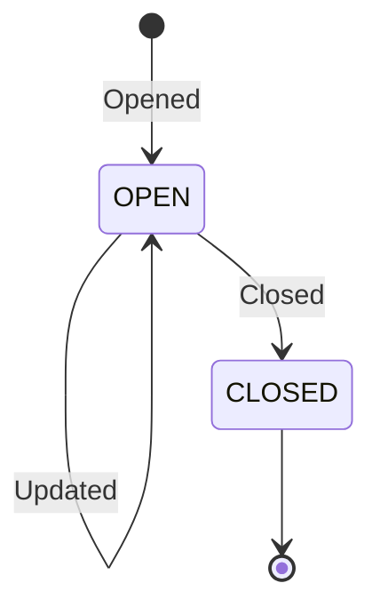

Generic State
=============

## Introduction to Event-Driven State Machines in Microservices Architecture

In the broad landscape of Information Technology, systems are designed to handle tasks, process data, and interact with users and other systems. A fundamental aspect of system design is understanding how these interactions occur and how the system responds to various inputs. This understanding becomes even more crucial in a microservices architecture, where a system is divided into smaller, independent services, each responsible for a specific functionality.

Our focus here is to introduce an advanced concept within this domain: the event-driven state machine. This concept is a leap from traditional linear or request-response models of interaction. Instead of a straightforward input-output mechanism, an event-driven state machine introduces a dynamic and responsive way of handling processes.

To grasp this concept, let's break down the key terminologies and their roles:

1. **Stateful Entities**: These are the core components of our system. Like actors in a play, each Stateful Entity has a role and a specific state they are in at any given time. This state encapsulates all the information and properties relevant to the entity at that moment.

2. **States**: A State is a particular condition or mode in which a Stateful Entity exists. It's like a snapshot of the entity at a specific point in time, capturing all its current characteristics.

3. **Transitions**: Transitions are the pathways between States. When an entity 'transitions,' it moves from one state to another, often changing its properties or behavior in response to certain triggers.

4. **Events**: In our system, Events are significant occurrences that can trigger Transitions. These could be actions taken by users, signals from other systems, or even internal processes reaching a particular outcome.

5. **State Event vs Generic Event**: A State Event specifically triggers a change in the state of an entity, whereas a generic event could be any significant occurrence in the system that doesn't necessarily lead to a state change.

6. **Commands**: These are explicit instructions, usually from a user, that direct the system to perform a certain operation. In the context of our state machine, a Command could initiate a State Event that leads to a Transition.

By understanding these concepts, we can see how our microservices architecture becomes a dynamic and responsive ecosystem. Each service, or Stateful Entity, is not just performing a task but is actively transitioning between states based on the events it encounters. This approach allows for more sophisticated interactions, adaptive behaviors, and ultimately, a more robust and efficient system.

As we delve deeper into these concepts, remember that the focus here is on the evolving nature of our services and how they interact and respond to various stimuli in an interconnected environment.

## Simple Example

Explanation of the Diagram:

- `[*] --> OPEN: Opened`:
  This represents the initial state transition.
  An `Open` command translates to an `Opened` event.
  The `Opened` event transitions from nothing to the 'OPEN' state

- `OPEN --> OPEN: Updated`:
  In the 'OPEN' state, when an 'update' command is received, the account remains
  in the 'OPEN' state, but its 'spec' (specifications or details) are updated.

- `OPEN --> CLOSED: Closed`:
  From the 'OPEN' state, upon receiving a 'close' command, the account
  transitions to the 'CLOSED' state.

## Flow

General Event -> State Event
Command -> State Event
State Event + State -> Transition
Transition -> State
Transition -> Chain Event
Transition -> Side Effect

