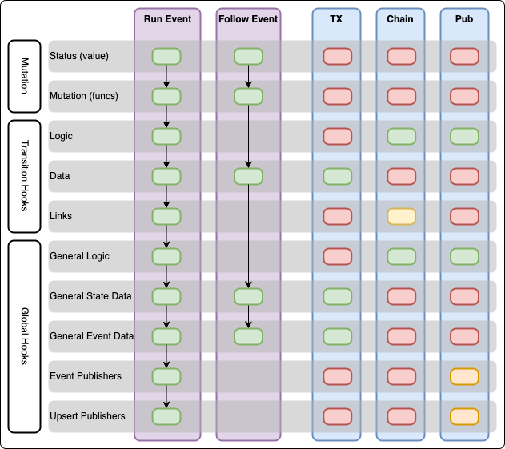

State Machine Hooks
===================



Broadly there are three main types of transition handler on a state machine:

- Mutations, which run for each transition, used to mutate the state.
- Event Hooks, which run after each transition, used to perform side effects.
- State Hooks, which run once after a chain of transitions.

A 'Transition' is the movement from one state to another, which is triggered by
an event.

Create a transition from the state machine using the typed builders in the
generated code.

```go
transition := sm.
    From(foo_pb.FooState_ACTIVE).
    OnEvent(foo_pb.FooPSMEventArchived)
```

returns a transition which will run when the state machine is in the 
`ACTIVE` state and the `FooPSMEventArchived` event is received.

## Mutations

Mutations run for each event, for specific events, and can be filtered to run
only from specific starting statuses. They are used to mutate the state data and
status.

### SetStatus

The 'SetStatus' mutation simply sets the status of the state machine.
It is not a callback function, meaning that the destination state must be
determined at build time. This is the only way to set the status.

When logic is required to determine the next state, use a logic hook and a
specific event for the transition to the next state, and 'Chain' that event.

```go
sm.From(foo_pb.FooState_ACTIVE).
    OnEvent(foo_pb.FooPSMEventArchived).
    SetStatus(foo_pb.FooState_ARCHIVED)
```

(note we don't need the return value, the transition is registered to the state
machine using the chaining methods)

### Callback Mutations

To mutate the state data, register a Mutation callback function

Mutation functions have mutable access to the State Data and read-only access to
the incomming event. Note, since this is Go, there is no such thing as mutable
and read-only, these are performed in code after the fact.

The state is cloned before the function is called, so the function can mutate
the state data without side effects.

- Cannot publish events
- No database access
- Must not have any side effects other than mutating state data


```go
sm.From(foo_pb.FooState_ACTIVE).
    OnEvent(foo_pb.FooPSMEventArchived).
    SetStatus(foo_pb.FooState_ARCHIVED).
    Mutate(foo_pb.FooPSMMutation(func(
        state *foo_pb.FooStateData,
        event *foo_pb.FooEventType_Archived,
    ) error {
        // mutate the state data
        state.Archived = true
        return nil
    }))
```

Use the error return for validation or state issues. The error will be returned
to the outer caller, which should pass that on to the user.

## Event Hooks

Event Hooks run after each transition, they receive the state after mutation,
and the event, and must not modify either.

Event hooks can be 'general', in that they run for all event types, or specific
to one event type.

### Logic

Callback function with access to the State Data and the incomming event.

- Can publish side-effects and chain events.
- No access to the database transaction.
- Runs only on RunEvent
- Must not modify state data

### Data

Callback function with access to the State Data and the incomming event.

Used to store pre-calculated objects for other queries.

- Has direct *Write Access* to the database transation
- TX must be consistent and forces high TX isolation
- Runs on Run or Follow
- Must not modify state data

### Link

Callback function with access to State Data and the incomming event.

Used to cause transitions in another state machine atomically.

- Must not modify state data
- Runs only on RunEvent
- TODO: Read Only access to the database transaction for upsert lookups

## State Hooks

State Hooks run (at least) once after a chain of transitions, they receive the
final state after all mutations and event hooks have run, and they do not
receive the incomming events.

Unlike Event Hooks, they cannot be filtered by event type.

## General Logic

## General State Data

## General Event Data

## Event Publisher

## Upsert Publisher
